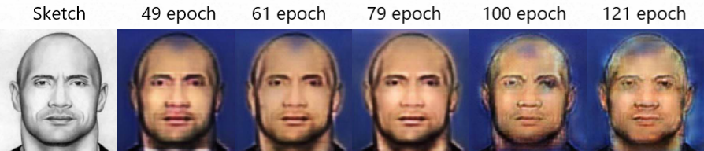
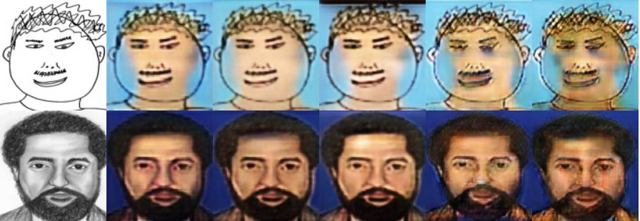
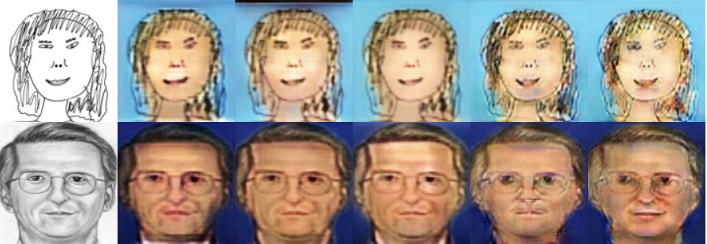
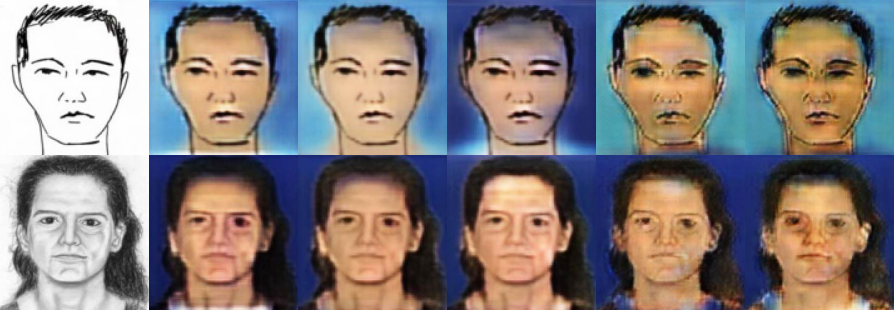

# Sketch2Photo

# Описание работы
Возможно ли при помощи нейронной сети оживить рисунок?  
Конечно возможно и примеров таких проектов великое множество. Но если есть желание повторить их успех самому, то почему нет?  
В данной работе для раскрашивания рисунков использовалась генеративно-состязательная сеть <a href="https://github.com/junyanz/BicycleGAN"> BicycleGAN. </a>  
BicycleGAN имеет не тривиальную архитектуру, состоящую из генератора, вариационного-автоэнкодера и двух дискриминаторов. Генератор пытается создать новое изображение, используя не только случайный шум, но и входное изображение. Тренировка происходит в два этапа:
<ul>
 <li> На первом этапе целевое изображение поступает на энкодер. Далее на генератор поступает сэмпл из энкодера и входное изображение - выход сравнивается с целевым изображением; </li>
 <li> На втором этапе генератор пытается обмануть дискриминатор. Далее выходное изображение поступает на энкодер, который переводит предсказанное изображение в латентное пространство. Полученное распределение сравнивается с начальным (нормальным) и энкодер обучатеся.</li>
</ul>  

Модель обучалась на 606 фотографиях и рисунков человеческих лиц.

# Результаты  

Уже с первых эпох можно заметить, что модель хорошо отделяет лицо от фона на изображении. Тем не менее, при нечетких рисунках - фон залезает на лицо.
Разнообразие заднего плана оставляет желать лучшего, это связано с тем, что в исходном датасете фотографии были выполнены преимущественно на голубом и синем фоне.
В обучении можно выделить 3 характерных этапа:

<ul>
 <li> Модель учится отличать изображение лица от заднего плана, при этом практически не обращает внимание на цвета для первого и второго; </li>
 <li> Модель подбирает цвета для всего изображения. Второй этап начинается приблизительно с 20 эпохи. На 70 эпохе этап уже подходит к концу. Можно заметить, что цвета распределены логично, но само изображение находятся под "матовым стеклом";  </li>
 <li> На этом этапе модель пытается детализирвать изображение, добавив на него блики, тени и т.д. Но, к сожалению, с 130 эпохи добавляет только артефакты. </li>
</ul>

  

  

  

  

